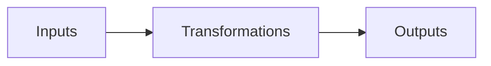

# Key Terms
- Operations: Involves business processes that result in the transformation of inputs (i.e. resources) into outputs (i.e. goods and services).
- Operations management: the action of a manager to plan, organise and control the business processes that transform inputs into outputs in a way that ensures the business achieves its strategic goals
- Inputs: the resources used in the transformation process 
- Outputs: Products
# What do operations influence?
Operations have a huge impact on
- The quality of a good or service
- The speed of which  a good or service is produced or delivered
- The total cost of delivering the good or service
- The stock or staff available to satisfy customer demands

# Types of inputs
An input is a resource that is uses during production
1. Material - these are raw materials that are transformed in to products
2. Capital equipment- this is a major, expensive equipment used to process the input into output
3. Labour - the human resources needed to complete a job
4. Information - This is information on hand or readily available to the company that they can use to enhance their operations
5. Time - Coordinating all the resources within a specific time frame
6. Money - used to continue the production process
# Differentiation
## Price vs Quality
The main objective of a business is to make a profit. To achieve this, a business must differentiate itself from the competition. Operations involves making decisions differentiating yourself based on price vs quality.
## How can a business add value?
1. Customer service
	1. JB Hi Fi
2. Cheaper
	1. 
3. Better quality
	1. 
4. Healthier
	1. 
5. Durability
	1. 
6. Warranty
	1. 
7. Faster e.g. delivery
	1. 
