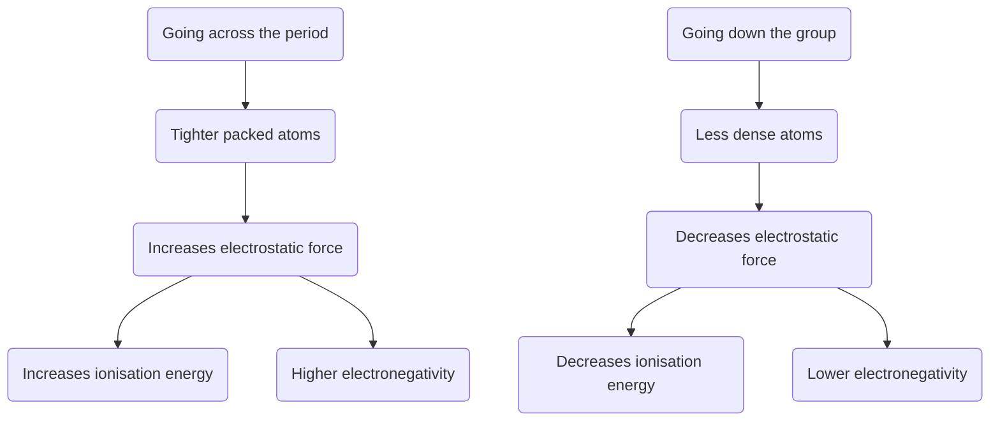

# Atomic radius
- Measured from the **centre** of the **nucleus** to the **valence** shell
- As you go **across** the periods, atomic radius **decreases**
    - Greater **electrostatic** force between protons & electrons as these numbers are increasing
- As you go **down** the groups, atomic radius **increases**
    - More **shells** are added, increasing the distance
# Ionisation energy
- **Refers** to the energy required to **remove** an **electron** from an atom

    - First electron ionisation energy → energy required to remove an electron gaseous state.

- Going across the periods, ionisation energy **increases**

    - Greater **electrostatic** force between protons & electrons as you go across

- Going down the groups, ionisation energy **decreases**

    - More shells are **added**, increasing distance, **lowering** the **electrostatic** force.

  

# Electronegativity

  

- **Refers** to the atom’s **ability** to **attract** to form a bond

- Going across the periods, electronegativity **increases**

    - **Non-metals** tend to accept electrons to achieve stable configuration.

    - Easier to attract an electron as there is a higher electrostatic force.

- Going down the groups, electronegativity **decreases**

    - Atomic number is larger, meaning a lower electrostatic force, less likely to attract electrons

- **Fluorine** is the most electronegative element with oxygen as second & not chlorine as there is an **increased** radius for chlorine

  

  